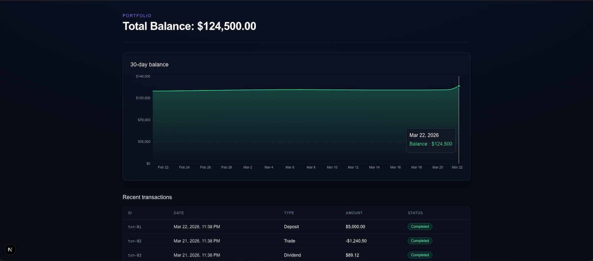

# GOLDH · Golden Horizon Intelligence



Production-style fintech dashboard: **Next.js (App Router)**, **TypeScript**, **Tailwind**, **Zod**, **TanStack Query & Table**, **Zustand**, and an ultra-dark institutional UI with amber accents. Pulse market data is backed by **CoinGecko** on the server with a typed mock fallback so the app still runs offline.

## Run it locally

```bash
git clone <your-fork-or-repo-url>
cd AI-Fintech-Dashboard
npm install
npm run dev
```

Open [http://localhost:3000](http://localhost:3000). For a production check:

```bash
npm run build
npm start
```

No `.env` is required for the public CoinGecko flows in this repo; rate limits may trigger the mock fallback (the UI labels live vs sample data).

---

## Building this UI quickly with AI (how this repo was shaped)

Modern product UI is less about typing JSX for hours and more about **constraints + iteration**. The approach used here transfers well to any stack:

1. **Lock architecture in repo rules**  
   Put non-negotiables in `.cursorrules` (or your agent’s project rules): server vs client state (e.g. React Query vs Zustand), feature folders, no `any`, Zod at boundaries, design tokens. That turns the model into a **junior teammate who reads the RFC first** instead of improvising patterns per file.

2. **One vertical slice, then fan out**  
   Start with one real flow: shell (header + nav) → one data hook + one API route + one Zod schema → one screen. Reuse that pattern for Pulse, asset detail, paywall, etc. AI is excellent at **cloning a proven slice** once the first one exists.

3. **Skills and short-lived docs**  
   Use editor/agent **skills** for repeatable workflows (Next.js App Router quirks, TanStack Table column patterns, Recharts gotchas). Keep “how we do things here” in skills and rules, not scattered chat-only comments in source.

4. **Prompt for verification, not just code**  
   After each chunk, ask for `build` + `lint` + a quick manual path (e.g. home → Pulse → row → asset). Catches type and routing issues early.

5. **Brand assets as first-class files**  
   Favicons and header marks live under `public/` (e.g. `goldh-logo.png`) and are wired in root `metadata` and `GoldhLogoHomeLink` so **logo and tab icon stay consistent** without hunting through components.

6. **Remove scaffolding noise before sharing**  
   Drop “Phase 1” placeholder copy, `console.*` debugging, and chatty comments so a GitHub clone is **immediately presentable** to investors or teammates.

---

## Tech stack

| Area | Choice |
|------|--------|
| Framework | Next.js App Router |
| Types & runtime validation | TypeScript + Zod |
| Server data | Route handlers + TanStack Query |
| Global UI state | Zustand |
| Tables | TanStack Table v8 |
| Charts | Recharts (Pulse / asset detail) |
| Styling | Tailwind CSS + shadcn-style primitives |

---

## Project layout (high level)

- `src/app/` — routes, layouts, API routes
- `src/features/` — domain slices (`pulse`, `asset-detail`, `paywall`, etc.)
- `src/components/layout/` — shell, header, sidebar, bottom nav
- `src/lib/` — shared clients, mocks, CoinGecko helpers
- `public/` — static assets including the Golden Horizon logo used in chrome and metadata

---

## License

Use and modify per your organization’s policy.
